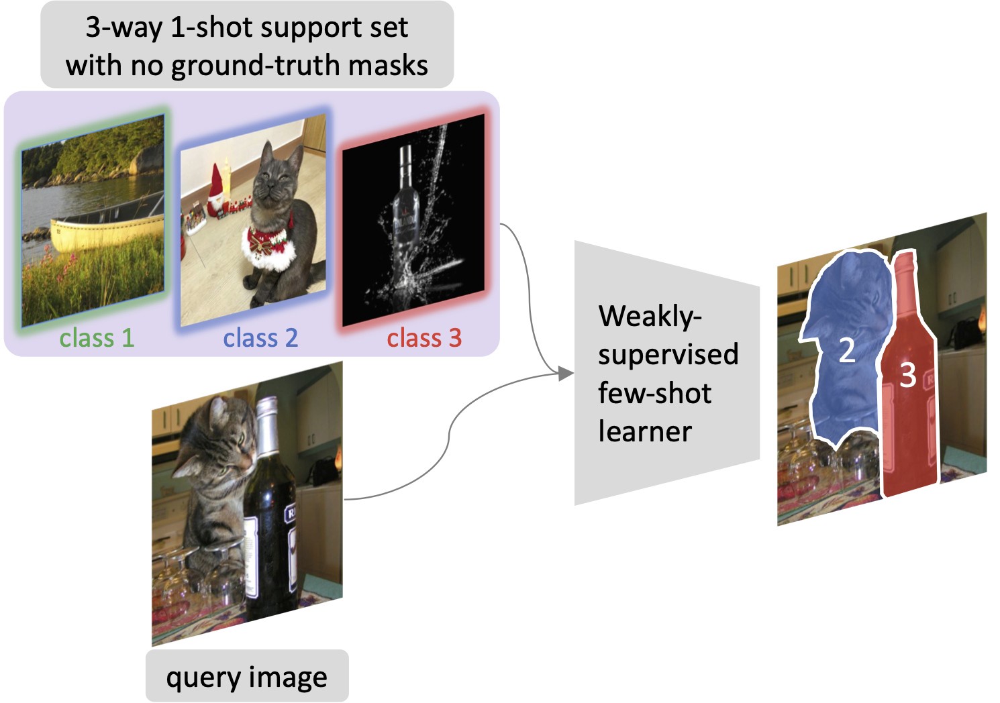

<div align="center">
  <h1> Distilling Self-Supervised Vision Transformers for Weakly-Supervised Few-Shot Classification & Segmentation </h1>
</div>

<div align="center">
  <h3><a href=http://dahyun-kang.github.io>Dahyun Kang<sup>1,2</sup></a> &nbsp;&nbsp; Piotr Koniusz<sup>3,4</sup> &nbsp;&nbsp; Minsu Cho<sup>2</sup> &nbsp;&nbsp; Naila Murray<sup>1</sup> </h3>
  <h4> <sup>1</sup>Meta AI &nbsp; <sup>2</sup>POSTECH &nbsp; <sup>3</sup>Data61🖤CSIRO &nbsp; <sup>4</sup>Australian National University</h4>
</div>
<br />


</div>
<br />

<div align="center">
  
</div>

This repo is the official implementation of the CVPR 2023 paper: [Distilling Self-Supervised Vision Transformers for Weakly-Supervised Few-Shot Classification & Segmentation](https://openaccess.thecvf.com/content/CVPR2023/papers/Kang_Distilling_Self-Supervised_Vision_Transformers_for_Weakly-Supervised_Few-Shot_Classification__Segmentation_CVPR_2023_paper.pdf).


## Environmnet installation
This project is built upon the following environment:
* [Ubuntu 18.04](https://ubuntu.com/download)
* [Python 3.10](https://pytorch.org)
* [CUDA 11.0](https://developer.nvidia.com/cuda-toolkit)
* [PyTorch 1.12.0](https://pytorch.org)

The package requirements can be installed via `environment.yml`, which includes
* [`pytorch`](https://pytorch.org)==1.12.0
* [`torchvision`](https://pytorch.org/vision/stable/index.html)==0.13.0
* [`cudatoolkit`](https://developer.nvidia.com/cuda-toolkit)==11.3
* [`pytorch-lightning`](https://www.pytorchlightning.ai/)==1.6.5
* [`einops`](https://einops.rocks/pytorch-examples.html)==0.6.0
```bash
conda env create --name pytorch1.12 --file environment.yml -p YOURCONDADIR/envs/pytorch1.12
conda activate pytorch1.12
```
Make sure to replace `YOURCONDADIR` in the installation path with your conda dir, e.g., `~/anaconda3`

## Datasets
* [PASCAL VOC 2012](http://host.robots.ox.ac.uk/pascal/VOC/voc2012/) and [SBD](http://home.bharathh.info/pubs/codes/SBD/download.html)
* [Microsoft COCO 2014](https://cocodataset.org/#download)

Download the datasets by following the file structure below and set `args.datapath=YOUR_DATASET_DIR`:

```
    YOUR_DATASET_DIR/
    ├── VOC2012/
    │   ├── Annotations/
    │   ├── JPEGImages/
    │   ├── ...
    ├── COCO2014/
    │   ├── annotations/
    │   ├── train2014/
    │   ├── val2014/
    │   ├── ...
    ├── ...
```


## Training with pixel-level supervision
```bash
python main.py --datapath YOUR_DATASET_DIR \
               --benchmark {pascal, coco} \
               --logpath YOUR_DIR_TO_SAVE_CKPT \
               --fold {0, 1, 2, 3} \
               --sup mask
```

## Training with image-level supervision
```bash
python main.py --datapath YOUR_DATASET_DIR \
               --benchmark {pascal, coco} \
               --logpath YOUR_DIR_TO_SAVE_CKPT \
               --fold {0, 1, 2, 3} \
               --sup pseudo
```


## CST model checkpoints
### Experimental results on Pascal-5<sup>i</sup> datasets on the FS-CS task.

<table>
  <tr>
    <td colspan="5" align="center"><strong>Performance results</strong></td>
    <td colspan="4" align="center"><strong>Links to download checkpoints</strong></td>
  </tr>
  <tr>
    <td>methods</td>
    <td colspan="2" align="center">1-way 1-shot</td>
    <td colspan="2" align="center">2-way 1-shot</td>
    <td colspan="4" align="center">4-fold validation folds</td>
  </tr>
  <tr>
    <td>metric</td>
    <td>cls. 0/1 ER</td>
    <td>seg. mIoU</td>
    <td>cls. 0/1 ER</td>
    <td>seg. mIoU</td>
    <td>fold0</td>
    <td>fold1</td>
    <td>fold2</td>
    <td>fold3</td>
  </tr>
  <tr>
    <td>image-level supervised models</td>
    <td align="center">79.9</td>
    <td align="center">33.2</td>
    <td align="center">64.6</td>
    <td align="center">31.9</td>
    <td align="center"><a href="https://postechackr-my.sharepoint.com/:u:/g/personal/kjdr86_postech_ac_kr/EU5xRov2iCJJpLUQKYbv03sBoiKwPIZSiN1L6WQrcRLUZQ?e=mwL8d5">link</a></td>
    <td align="center"><a href="https://postechackr-my.sharepoint.com/:u:/g/personal/kjdr86_postech_ac_kr/Ef7Bm_EADmNMlItMl5CQJdkBKRkJiEvGgJ2T9HxRjOXjPg?e=1tj7Bd">link</a></td>
    <td align="center"><a href="https://postechackr-my.sharepoint.com/:u:/g/personal/kjdr86_postech_ac_kr/EbVKNOyQsr9PhAz2jmxP0mcBnJ382EcQa2pPsDyVEsBKRw?e=Drb32z">link</a></td>
    <td align="center"><a href="https://postechackr-my.sharepoint.com/:u:/g/personal/kjdr86_postech_ac_kr/EWSQGWfwuLpLr6OyQ4te7l4BvEli29Qx-516w9XEjPcslg?e=eXdbKs">link</a></td>
  </tr>
  <tr>
    <td>pixel-level supervised models</td>
    <td align="center">85.7</td>
    <td align="center">55.5</td>
    <td align="center">70.4</td>
    <td align="center">53.7</td>
    <td align="center"><a href="https://postechackr-my.sharepoint.com/:u:/g/personal/kjdr86_postech_ac_kr/EWq-xcsRwOlOldLVMxET_qUBeiGZ5ze5qwUKX6ps_slACQ?e=cDtHrl">link</a></td>
    <td align="center"><a href="https://postechackr-my.sharepoint.com/:u:/g/personal/kjdr86_postech_ac_kr/Efd7SEl407FEpMhej3KZa70B9LJTTUW3zjeA3nNf2c53jQ?e=CIiieA">link</a></td>
    <td align="center"><a href="https://postechackr-my.sharepoint.com/:u:/g/personal/kjdr86_postech_ac_kr/EUj-HDidKThEsOrTNIzLESIBlz2GTQANTtaibzs4m9s5cw?e=hmQp04">link</a></td>
    <td align="center"><a href="https://postechackr-my.sharepoint.com/:u:/g/personal/kjdr86_postech_ac_kr/Ea58qL-18fdIn11KfBNFvIcBsx-hJ6pkxoUSfQh4kTnQMw?e=6w8XDt">link</a></td>
  </tr>
</table>


### Experimental results on COCO-20<sup>i</sup> datasets on the FS-CS task.

<table>
  <tr>
    <td colspan="5" align="center"><strong>Performance results</strong></td>
    <td colspan="4" align="center"><strong>Links to download checkpoints</strong></td>
  </tr>
  <tr>
    <td>methods</td>
    <td colspan="2" align="center">1-way 1-shot</td>
    <td colspan="2" align="center">2-way 1-shot</td>
    <td colspan="4" align="center">4-fold validation folds</td>
  </tr>
  <tr>
    <td>metric</td>
    <td>cls. 0/1 ER</td>
    <td>seg. mIoU</td>
    <td>cls. 0/1 ER</td>
    <td>seg. mIoU</td>
    <td>fold0</td>
    <td>fold1</td>
    <td>fold2</td>
    <td>fold3</td>
  </tr>
  <tr>
    <td>image-level supervised models</td>
    <td align="center">78.2</td>
    <td align="center">19.6</td>
    <td align="center">62.4</td>
    <td align="center">18.3</td>
    <td align="center"><a href="https://postechackr-my.sharepoint.com/:u:/g/personal/kjdr86_postech_ac_kr/EVzV4jVY_7xJs9fQNetBPdwBo9O213fPNVjvuCUm_luQcw?e=pCcava">link</a></td>
    <td align="center"><a href="https://postechackr-my.sharepoint.com/:u:/g/personal/kjdr86_postech_ac_kr/Ebkw496aa4ZOi_VTrDRGDX0BL0sQgYU6rLtmgyXP8i8rmg?e=syBGkn">link</a></td>
    <td align="center"><a href="https://postechackr-my.sharepoint.com/:u:/g/personal/kjdr86_postech_ac_kr/ERySff4YIw9NvPd6hQmood0BQaDij_XNoUbAdWCgHRlo2Q?e=bgtmds">link</a></td>
    <td align="center"><a href="https://postechackr-my.sharepoint.com/:u:/g/personal/kjdr86_postech_ac_kr/EUJQGlJfH6xFl5wX1Lh54sEBzWXQoXPOdsL1w05AuLrgzw?e=zi6tFS">link</a></td>
  </tr>
  <tr>
    <td>pixel-level supervised models</td>
    <td align="center">80.8</td>
    <td align="center">38.3</td>
    <td align="center">64.0</td>
    <td align="center">36.2</td>
    <td align="center"><a href="https://postechackr-my.sharepoint.com/:u:/g/personal/kjdr86_postech_ac_kr/EVIFvKLXlG9FrUFiDG_wWSMBaG3fTiuwubvVCcmLP7a2Ew?e=rr1FZ2">link</a></td>
    <td align="center"><a href="https://postechackr-my.sharepoint.com/:u:/g/personal/kjdr86_postech_ac_kr/ETuAEZjSdVhCrfddyzrLMm0BpNtO-ekrlMD-MbzE43_IlA?e=dlRAgd">link</a></td>
    <td align="center"><a href="https://postechackr-my.sharepoint.com/:u:/g/personal/kjdr86_postech_ac_kr/EYpaIayMcB1Hob9owUULluAB3bA6yxIEpRa36awD_mPETg?e=eFmC2v">link</a></td>
    <td align="center"><a href="https://postechackr-my.sharepoint.com/:u:/g/personal/kjdr86_postech_ac_kr/EfmmpQtDIdZDiSj2WTmvoksBDWvYtfkZfry4PbIUisw8Jg?e=SFHdGU">link</a></td>
  </tr>
</table>


## :scroll: BibTex source
If you find our code or paper useful, please consider citing our paper:

```BibTeX
@inproceedings{kang2023distilling,
  title={Distilling Self-Supervised Vision Transformers for Weakly-Supervised Few-Shot Classification \& Segmentation},
  author={Kang, Dahyun and Koniusz, Piotr and Cho, Minsu and Murray, Naila},
  booktitle={Proceedings of the IEEE/CVF Conference on Computer Vision and Pattern Recognition},
  year={2023}
}
```

